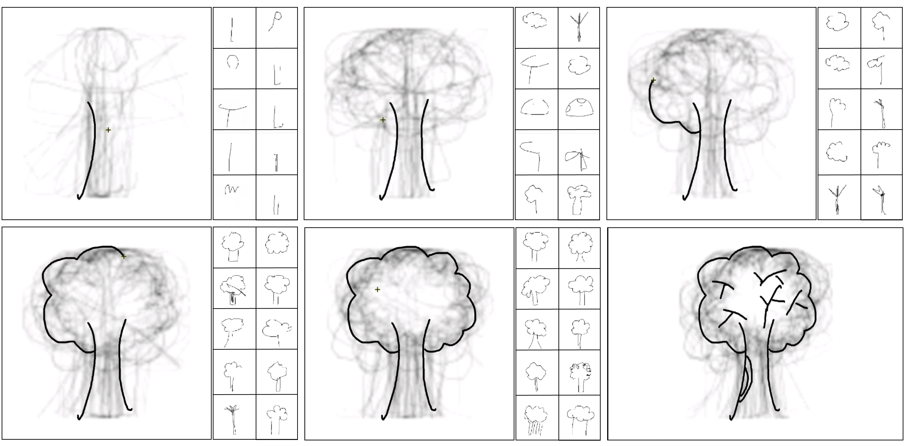
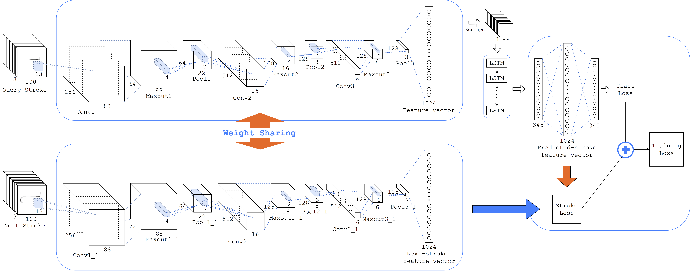
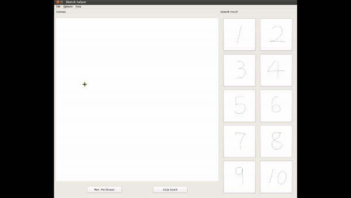

# Sketch Helper

This is the official implementation of [Sketch Helper](https://ieeexplore.ieee.org/document/8607060) networks and application by Jungwoo Choi, Heeryon Cho, Jinjoo Song and Sang Min Yoon.
## Representative Image

## Network

## Video
https://youtu.be/THfX-oLVtRY
# Download
Pretrained weight can be downloaded below links from google drive

- [Google drive link](https://drive.google.com/drive/folders/1pvR4ntu3u9U5_uwxsduN_RE3K8mA9pG6?usp=sharing)
  - Trained with 345 classes from quick draw dataset from aircraft carrier(1) to zebra(344) and zigzag(0).
  - The number in parenthesis represent the class number.
  
- [Quick Draw! dataset](https://console.cloud.google.com/storage/browser/quickdraw_dataset/full/binary?pli=1)
  - We use binary files which is contributed by [Google Quick Draw](https://github.com/googlecreativelab/quickdraw-dataset)
  
# Training

## Requirements
- Caffe
- Python2.7

## Generate Datasets
- Make images and file list from binary files

  - Update filelist.txt to your downloaded Quick Draw dataset location.
  
  - Use [gen_raw_dataset.py](https://github.com/kookmin-hci/sketch_helper/blob/master/caffe/scripts/gen_raw_dataset.py) which is located in "skech_helper/caffe/scripts"
  ```
  $ mkdir imgData
  $ python repo_root/caffe/scripts/gen_raw_dataset.py -f filelist.txt
  ```
    Note: this code will be generated dataset class from aircraft carrier(0)to zigzag(344)
- Make next stroke dataset file list from modifying original dataset file list(75000_Train_stroke.txt)
  ```
  $ cp 75000_Train_stroke.txt  75000_Train_stroke2.txt
  $ vim 75000_Train_stroke2.txt
  ```
  Inside vim
  ```
  :g/_0.png/m .+4
  :%s/_0.png/_4.png/g
  ```
  
- Make clip label list from modifying original dataset file list (75000_Train_stroke.txt)
  ```
  $ cp 75000_Train_stroke.txt  75000_Train_stroke_label.txt
  $ vim 75000_Train_stroke_label.txt
  ```
  Inside vim
  ```
  :%s/_0.png \zs.*/0/g
  :%s/\_\[^0]\.png \zs.*/1/g
  ```
  
- Make LMDB by using convert_imageset tools from Caffe 

  - Update path in create_75000_stroke.sh code and run the script
  ```
  $ repo_root/caffe/scripts/create_75000_stroke.sh
  ```
- Make image mean to normalize the data
  ```
  $ repo_root/caffe/scripts/make_imagenet_mean.sh
  ```
 
## Training the networks
- Update path inside the files
  - custom_test_next_stroke_final.prototxt
  - solver_next_stroke_final.prototxt
  
- Copy sketch_stroke folder to your caffe examples folder
  ```
  $ cp -rf repo_root/caffe/examples/sketch_stroke your_caffe/examples/
  ```

- Using train_next_final.sh to train the network
  ```
  $ cd your/caffe/location
  $ ./examples/sketch_stroke/train_next_final.sh
  ```
  
# Application
## Examples

## Requirements
- Caffe
- Python2.7
- PyQt5 (used version: 5.9.1)

## Build & Install PyQt5 for python2.7
- Check this tutorial [link](http://www.minsung.org/2017/12/building-pyqt5-with-python-2-7-on-ubuntu-16-04/)

## Run scribble.py
- Update Path for networks, image data, weight
- Let's play with demo.
  ```
  $ python scribble.py
  ```

# Citation
Please cite the paper in your publications if it helps your research:

    @ARTICLE{8607060, 
      author={J. {Choi} and H. {Cho} and J. {Song} and S. M. {Yoon}}, 
      journal={IEEE Transactions on Multimedia}, 
      title={SketchHelper: Real-time Stroke Guidance for Freehand Sketch Retrieval}, 
      year={2019}, 
      keywords={Three-dimensional displays;Feature extraction;Databases;Real-time systems;Shape;Media;Deep learning;Stroke-based modeling;sketch based sketch retrieval;shadow-guided drawing;deep learning}, 
      doi={10.1109/TMM.2019.2892301}, 
      ISSN={1520-9210},}
  
# License
This project is under [Apache License 2.0]()
